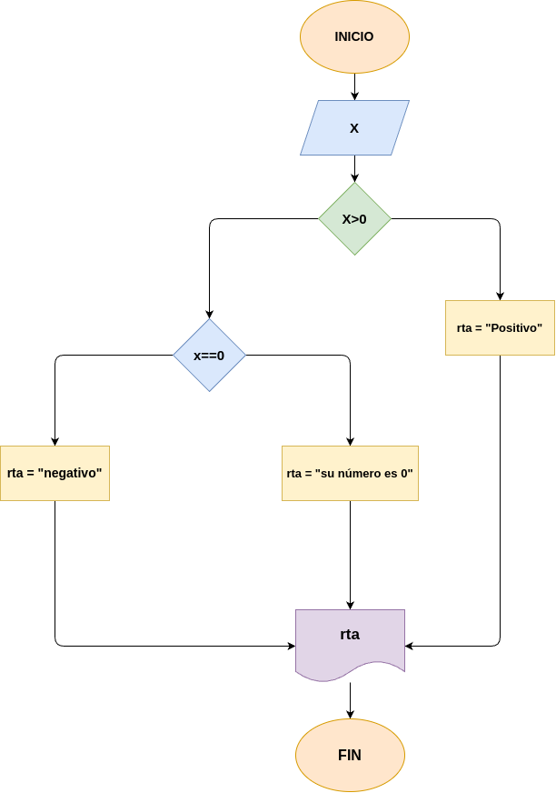

# Ejercicio 1: ¿Es_positivo?
Programa en Phyton para saber si un número es positivo o negativo o es 0.

## Análisis

### Variable de entrada 
- x: Número 

### Procesamiento
- $x > 0 = "positivo"$

- $x == 0 = "0"$

- $x < 0 = "negativo"$

### Variabe de salida
- rta = "positivo" o "0" o "negativo"

## Diseño

## Consturcción 

- codigo implementado en el archivo ¿Es_positivo?

