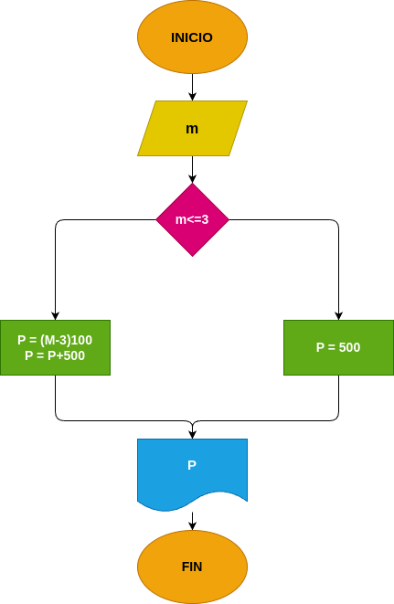

# Ejercicio 2: Llamada_telefonica
Programa en Phyton para calcular el tiempo y el costo de una llamada  telefonica.

## Análisis

### Variable de entrada 
- m: minutos de llamada

### Procesamiento
- p : (m + 3) * 100

$m <= 3 = P=$500

$m > 3 = P=(m-3)*100
$P= P+500

### Variabe de salida
- P: precio de llamada

## Diseño

## Consturcción 

- codigo implementado en el archivo Llamada_telefonica

