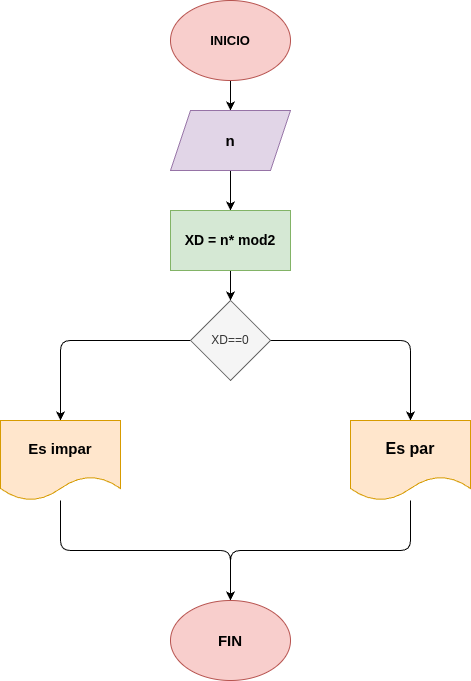

# Ejercicio 3: Par_O_Impar
Programa en Phyton para ver si un Número entero es par o impar.

## Análisis

### Variable de entrada 
- n: número entero

### Procesamiento
- XD : n*mod2

$XD <== 0$

$XD > 0$

### Variabe de salida
- Es PAR
- Es IMPAR

## Diseño

## Consturcción 

- codigo implementado en el archivo Par_o_Impar
