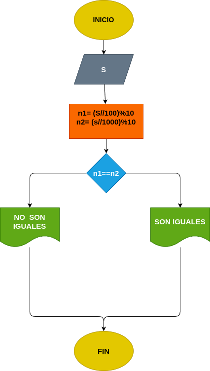

# Ejercicio 4: ultimos2_iguales
Programa en Phyton para ver si los dos ultimos Números son iguales

## Análisis

### Variable de entrada 
- s= Número 

### Procesamiento
- ultimos_digitos = s % 10
- penultimo_digito = (s//10)%10

if: ultimo_digito == penultimo digito
rta = iguales

else: 
rta = "diferentes"

### Variabe de salida
- es igual
- es diferente

## Diseño

## Consturcción 

- codigo implementado en el archivo ultimos2_iguales
