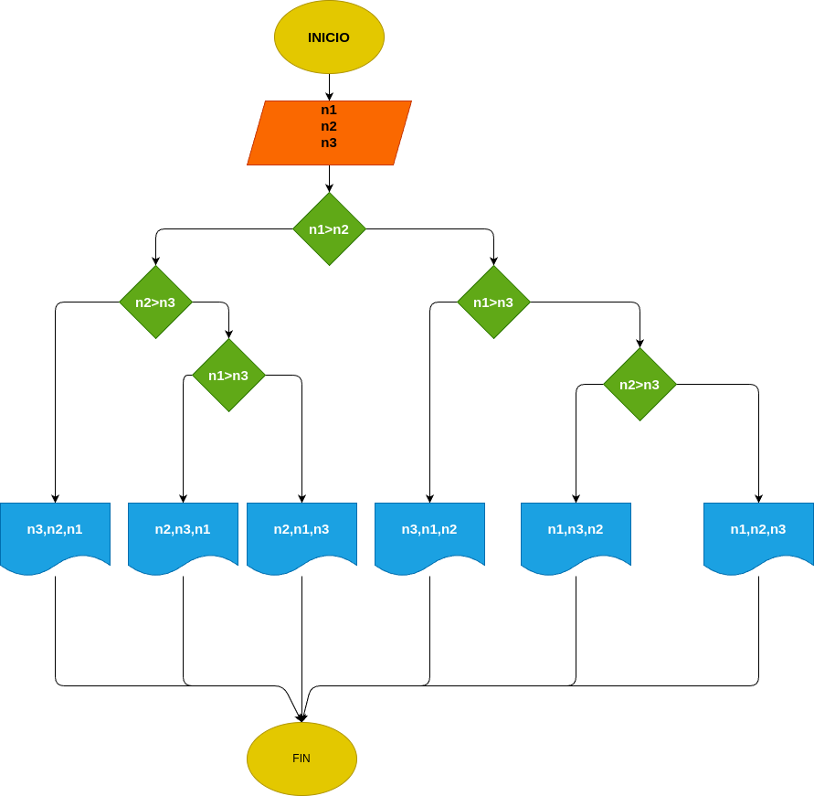

# Ejercicio 5: cual_es_mayor
Programa en Phyton para ver cual de los tres números es el mayor

## Análisis

### Variable de entrada 
- n1 = número 1
- n2 = número 2
- n3 = número 3

### Procesamiento
- $n1 > n2$
- False:
    - $n2 > n3$
- True:
    - $n1 > n3$
    - $n2 > n3$

### Variabe de salida
- rta

## Diseño

## Consturcción 

- codigo implementado en el archivo "cual_es_mayor"
