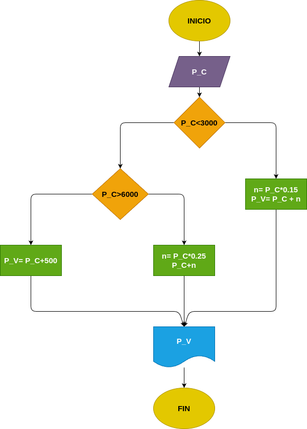

# Ejercicio 6: Precio_venta
Programa en Phyton para ver cual de los tres números es el mayor

## Análisis

### Variable de entrada 
- P_C =Precio de costo

### Procesamiento
- P_C <= 3000

- True:
    - n = P_C*0.15
    - P_V = P_C + n
- False: 
    P_C > 6000
    - True:
        - n = P_C*0.25
        - P_V = P_C + n
    - False:
        - P_V = P_C + 500

### Variabe de salida
- P_V = Precio de venta

## Diseño

## Consturcción 

- codigo implementado en el archivo "precio_venta"